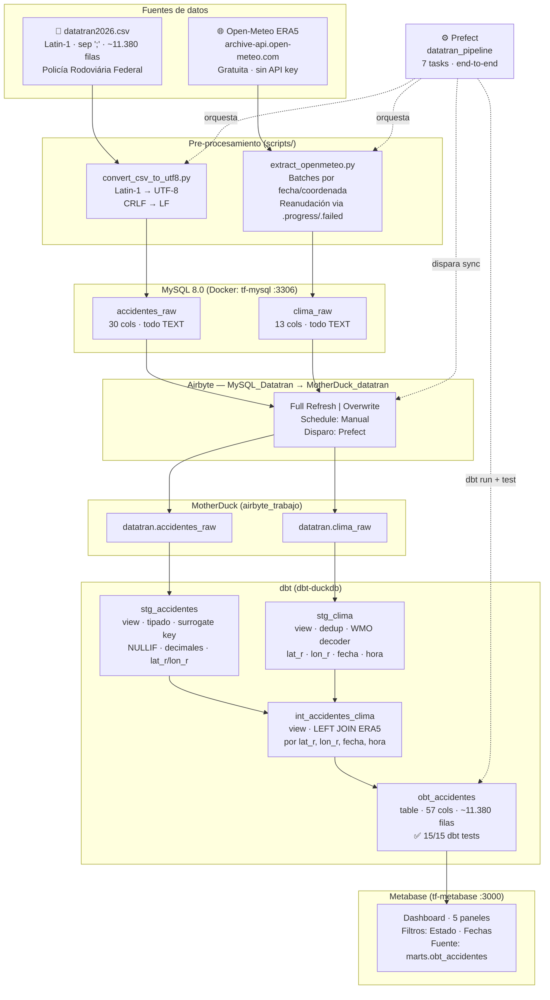

# Pipeline ELT — Accidentes de Tráfico en Brasil

Trabajo Práctico Final — Introducción a la Integración de Datos (MIA 03)

## Descripción

Pipeline ELT completo que integra datos de accidentes de tráfico de Brasil (DATATRAN/PRF)
con datos climáticos históricos (Open-Meteo ERA5) para análisis multidimensional.

## Arquitectura

```
┌─────────────────────────────────────────────────────────────────────┐
│                          FUENTES DE DATOS                           │
│                                                                     │
│  datatran2026.csv                  Open-Meteo ERA5 API              │
│  (Latin-1, sep. ;, ~11.380 filas)  (archive-api.open-meteo.com)    │
│  Policía Rodoviária Federal        Reanalysis horario por coordenada│
└──────────┬──────────────────────────────────┬───────────────────────┘
           │                                  │
           ▼                                  ▼
  convert_csv_to_utf8.py            extract_openmeteo.py
  (Latin-1 → UTF-8, CRLF → LF)     (batches por fecha/coordenada,
  salida: data/*_utf8.csv            reanudación via .progress/.failed)
           │                                  │
           ▼                                  ▼
┌──────────────────────────────────────────────────────────────────┐
│                     MySQL 8.0  (Docker: tf-mysql)                │
│                                                                  │
│   datatran.accidentes_raw        datatran.clima_raw              │
│   (30 cols, todo TEXT)           (13 cols, todo TEXT)            │
└───────────────────────────┬──────────────────────────────────────┘
                            │  Airbyte  (Full Refresh | Overwrite)
                            │  MySQL_Datatran → MotherDuck_datatran
                            ▼
┌──────────────────────────────────────────────────────────────────┐
│                  MotherDuck  (airbyte_trabajo)                   │
│                                                                  │
│   datatran.accidentes_raw        datatran.clima_raw              │
└───────────────────────────┬──────────────────────────────────────┘
                            │  dbt  (dbt-duckdb)
                            ▼
┌──────────────────────────────────────────────────────────────────┐
│                     Capas de transformación                      │
│                                                                  │
│  staging (views)                                                 │
│    stg_accidentes  — tipado, NULLIF, decimales, surrogate key    │
│    stg_clima       — tipado, dedup, decodificación WMO           │
│                                                                  │
│  intermediate (view)                                             │
│    int_accidentes_clima  — LEFT JOIN por (lat_r, lon_r, fecha,   │
│                            hora); flag clima_join_match          │
│                                                                  │
│  marts (table)                                                   │
│    obt_accidentes  — One Big Table: 57 cols, ~11.380 filas       │
│                      15/15 dbt tests pasan                       │
└───────────────────────────┬──────────────────────────────────────┘
                            │
               ┌────────────┴────────────┐
               ▼                         ▼
┌──────────────────────┐   ┌─────────────────────────────────────┐
│  Metabase            │   │  Prefect  (datatran_pipeline)        │
│  (tf-metabase :3000) │   │                                     │
│                      │   │  1. ensure_containers_up            │
│  Dashboard con 5     │   │  2. load_accidentes_raw             │
│  paneles sobre       │   │  3. extract_openmeteo               │
│  obt_accidentes      │   │  4. load_clima_raw                  │
│                      │   │  5. airbyte_sync                    │
│  Filtros: Estado,    │   │  6. dbt_run                         │
│  Fechas              │   │  7. dbt_test                        │
└──────────────────────┘   └─────────────────────────────────────┘
```



## Fuentes de datos

### Fuente 1: DATATRAN PRF 2026
- **Origen:** Policía Rodoviária Federal de Brasil — [dados.gov.br](https://dados.gov.br)
- **Archivo:** `datatran2026.csv` (~11,380 accidentes, año 2026)
- **Formato:** CSV, separador `;`, encoding Latin-1, fin de línea CRLF
- **Nota:** el campo `tracado_via` contiene `;` como separador interno de valores
  (ej: `Aclive;Reta`) — está siempre entre comillas en el CSV

### Fuente 2: Open-Meteo ERA5 (clima histórico)
- **Origen:** [open-meteo.com](https://open-meteo.com) — reanalysis ERA5
- **Costo:** gratuito, sin API key
- **Join con fuente 1:** `data_inversa` + `horario` + `latitude` + `longitude`
- **Variables principales:** precipitación, temperatura, humedad, viento, condición WMO,
  cobertura de nubes bajas (proxy niebla), radiación solar, flag `is_day`

## Requisitos previos

- Docker y Docker Compose
- Python 3.8+  (solo biblioteca estándar, sin dependencias adicionales)
- Airbyte (instancia local o en la nube)
- Cuenta MotherDuck con token
- dbt Core con adaptador DuckDB (`dbt-duckdb`)

## Estructura del proyecto

```
Trabajo_Final/
├── README.md
├── docs/
│   ├── PROGRESO.md                          # Checklist y estado del proyecto
│   ├── Grilla_Evaluacion_TP_Final.xlsx      # Criterios de evaluación
│   └── Verificaciondesuscripcion_Extracciondedatos.ipynb  # Análisis fuentes clima
├── workspaces/
│   ├── scripts/
│   │   └── convert_csv_to_utf8.py           # Paso 1: conversión del CSV
│   ├── containers/
│   │   ├── Dockerfile                       # Metabase + driver DuckDB
│   │   ├── docker-compose.yaml              # MySQL + phpMyAdmin + Metabase
│   │   ├── example.env                      # Variables de entorno (plantilla)
│   │   └── initdb/
│   │       ├── 00_setup.sh                  # Crea BDs y otorga permisos (se ejecuta primero)
│   │       ├── 01_schema.sql                # Schema MySQL (todo TEXT)
│   │       └── 02_load_data.sql             # Referencia histórica (carga gestionada por Prefect)
│   ├── dbt_proyect/
│   │   ├── dbt_project.yml
│   │   ├── profiles.yml
│   │   ├── packages.yml
│   │   ├── macros/generate_schema_name.sql
│   │   └── models/
│   │       ├── sources.yml
│   │       ├── staging/         # stg_accidentes, stg_clima + schema.yml
│   │       ├── intermediate/    # int_accidentes_clima
│   │       └── marts/           # obt_accidentes + schema.yml
│   └── prefect/
│       ├── pipeline.py
│       └── example.env
```

---

## Puesta en marcha

### Paso 1 — Convertir el CSV a UTF-8

El CSV original de DATATRAN está en Latin-1 con fin de línea CRLF. MySQL 8.0 requiere
UTF-8. El script `convert_csv_to_utf8.py` realiza la conversión sin modificar el archivo
original y maneja correctamente los campos con `;` internos (como `tracado_via`).

```bash
# 1. Copiar la plantilla y configurar la ruta a los CSV originales
cp workspaces/scripts/example.env workspaces/scripts/.env
# Editar .env y ajustar CSV_SOURCE_DIR con la ruta al directorio de los CSV originales

# 2. Ejecutar desde la raíz del proyecto
python3 workspaces/scripts/convert_csv_to_utf8.py
```

El script lee todos los `.csv` de `CSV_SOURCE_DIR` (definido en `workspaces/scripts/.env`)
y escribe los archivos convertidos en `data/` en la raíz del proyecto.

Salida esperada:
```
Origen  : /ruta/a/los/csvs/originales
Destino : /ruta/al/proyecto/data
Archivos: 1

  Leyendo    : .../datatran2026.csv
  Escribiendo: .../data/datatran2026_utf8.csv
  Filas escritas (incluye encabezado): 11381

Conversión completada.
```

Para convertir un archivo específico sin usar `.env`:
```bash
python3 workspaces/scripts/convert_csv_to_utf8.py \
    --input  /ruta/datatran2026.csv \
    --output /ruta/de/salida/datatran2026_utf8.csv
```

### Paso 2 — Configurar variables de entorno

```bash
cd workspaces/containers
cp example.env .env
```

Editar `.env` y ajustar al menos:

```dotenv
MYSQL_ROOT_PASSWORD=<contraseña segura>
MYSQL_PASSWORD=<contraseña para el usuario airbyte>
MYSQL_DATABASE=datatran
# CSV_DIR apunta a data/ en la raíz del proyecto (ruta relativa al docker-compose)
CSV_DIR=../../data
```

> `CSV_DIR` se monta en `/csv` dentro del contenedor MySQL. La ruta relativa
> `../../data` se resuelve desde `workspaces/containers/` hacia la raíz del proyecto.

### Paso 3 — Levantar los contenedores

```bash
cd workspaces/containers
docker compose up -d
```

Servicios que se inician:

| Servicio | Puerto | Descripción |
|---|---|---|
| `tf-mysql` | 3306 | MySQL 8.0 — fuente DATATRAN |
| `tf-phpmyadmin` | 8095 | Interfaz web para MySQL |
| `tf-metabase` | 3000 | Dashboard (Metabase + driver DuckDB) |

Al primer arranque, MySQL ejecuta automáticamente (en orden alfabético):
1. `00_setup.sh` — crea las bases `${MYSQL_DATABASE}` y `metabase`, otorga permisos a `airbyte`
2. `01_schema.sql` — crea la tabla `accidentes_raw` (todo TEXT)

> La carga de datos en `accidentes_raw` la gestiona el pipeline Prefect (`load_accidentes_raw`), no el initdb.

### Paso 4 — Verificar la carga

```bash
docker exec -it tf-mysql mysql -u airbyte -pairbyte datatran \
    -e "SELECT COUNT(*) AS total FROM accidentes_raw;"
```

Resultado esperado: `11380`

```bash
# Verificar que tracado_via con ; internos se cargó correctamente
docker exec -it tf-mysql mysql -u airbyte -pairbyte datatran \
    -e "SELECT tracado_via FROM accidentes_raw WHERE tracado_via LIKE '%;%' LIMIT 5;"
```

### Paso 5 — Configurar Airbyte

1. **Source MySQL** (`MySQL_Datatran`):
   - Host: IP ZeroTier de la máquina con Docker (estable, no cambia)
   - Puerto: `3306`, Base de datos: `tf-datatran`, Usuario: `airbyte`
   - Encryption: `required`, SSH Tunnel: `No Tunnel`
   - Update Method: `Scan Changes with User Defined Cursor`

2. **Destination MotherDuck** (`MotherDuck_datatran`):
   - MotherDuck Access Token: token de tu cuenta
   - Destination DB: `md:airbyte_trabajo`, Schema Name: `datatran`

3. **Connection**: `MySQL_Datatran → MotherDuck_datatran`
   - Schedule: `Manual` (Prefect dispara el sync)
   - Namespace: `Destination-defined`
   - Stream `accidentes_raw`: sync mode **Full Refresh | Overwrite**

### Paso 6 — Agregar clima_raw como segundo stream en Airbyte

La extracción ERA5 y la carga de `clima_raw` en MySQL las gestiona automáticamente el pipeline
Prefect (tasks `extract_openmeteo` y `load_clima_raw`). Una vez que el pipeline haya corrido
al menos una vez:

1. En Airbyte UI → Connection `MySQL_Datatran → MotherDuck_datatran` → Streams
2. Activar el stream `clima_raw` (13 campos) con sync mode **Full Refresh | Overwrite**
3. Guardar y ejecutar un sync manual

A partir de ahí el pipeline Prefect dispara el sync automáticamente en cada ejecución.

### Paso 7 — dbt: transformaciones y tests

```bash
cd workspaces/dbt_proyect
dbt deps --profiles-dir .
dbt run  --profiles-dir .
dbt test --profiles-dir .
```

### Paso 8 — Prefect: orquestación del pipeline completo

El pipeline en `workspaces/prefect/pipeline.py` automatiza todos los pasos anteriores:

```bash
cd workspaces/prefect
cp example.env .env
# Editar .env: MYSQL_PASSWORD, AIRBYTE_CONNECTION_ID
# (AIRBYTE_CONNECTION_ID: Airbyte UI → Connections → Settings → Connection ID)

pip install prefect mysql-connector-python

prefect server start &    # UI en http://localhost:4200
python pipeline.py
```

Tareas del pipeline en orden:
1. `ensure_containers_up` — `docker compose up -d` + espera MySQL
2. `load_accidentes_raw` — convierte CSVs a UTF-8, recrea `accidentes_raw` y carga todos los `*_utf8.csv`
3. `extract_openmeteo` — extrae ERA5 y genera `data/clima_openmeteo.csv` (con reanudación)
4. `load_clima_raw` — crea tabla `clima_raw` y carga el CSV en MySQL
5. `airbyte_sync` — dispara sync (Basic Auth) y hace polling hasta completar
6. `dbt_run` — `dbt deps` + `dbt run`
7. `dbt_test` — `dbt test`

### Paso 9 — Metabase: dashboard

Abrir `http://localhost:3000`, completar el setup inicial y agregar la base de datos:

| Campo | Valor |
|---|---|
| Driver | DuckDB |
| Nombre para mostrar | `Motherduck_Trabajo_Final` |
| Database file | `md:airbyte_trabajo` |
| Use DuckDB old_implicit_casting option | Activado |
| MotherDuck Token | Token de la cuenta (campo separado) |

---

## Detalle técnico: por qué se almacena todo como TEXT en MySQL

El CSV de DATATRAN tiene varios campos que requieren conversión no trivial:

| Campo | Problema | Solución en dbt |
|---|---|---|
| `km`, `latitude`, `longitude` | Decimal con coma (`-7,291548`) | `REPLACE(x, ',', '.')::DECIMAL` |
| `classificacao_acidente` | Valor `NA` literal como nulo | `NULLIF(x, 'NA')` |
| `tracado_via` | Múltiples valores con `;` interno | Se preserva como texto; split opcional en dbt |
| `data_inversa` | String `YYYY-MM-DD` | `CAST(x AS DATE)` |
| `horario` | String `HH:MM:SS` | `CAST(x AS TIME)` |
| `id`, `mortos`, etc. | Enteros como texto | `CAST(x AS BIGINT / INT)` |

Almacenar todo como TEXT en la tabla raw evita errores de tipo durante la ingesta y
delega toda la lógica de conversión a dbt, donde es testeable y versionable.

---

## Apagar los contenedores

```bash
cd workspaces/containers
docker compose down
# Para borrar también los datos persistidos:
docker compose down -v
```
